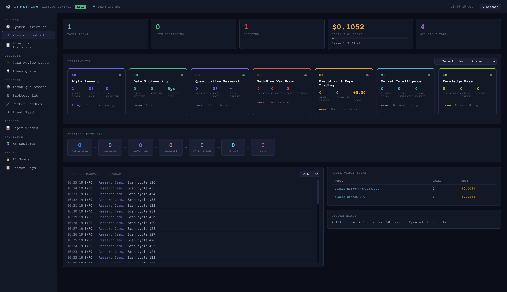
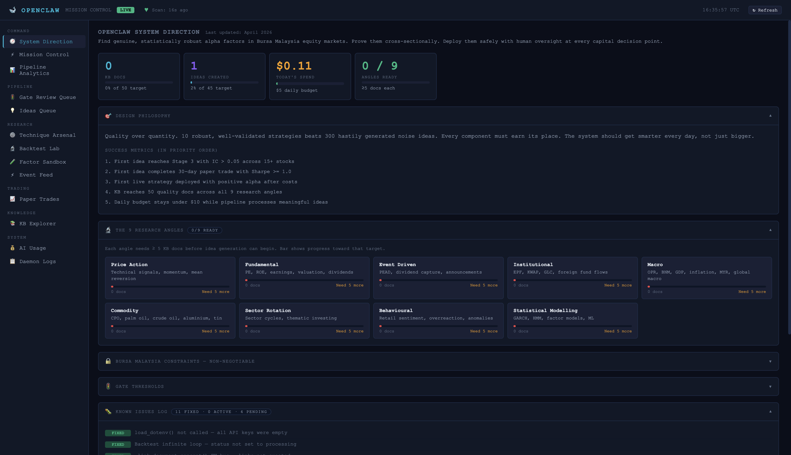

# Mark's Research Centre — Bursa Malaysia Quant Research Pipeline

A multi-agent research system that uses Claude to generate, adversarially review, backtest, and paper-trade quantitative equity strategies for Bursa Malaysia (FBM KLCI) — with a live dashboard, Telegram bot, and full cost tracking.

## How it works

Every idea goes through a gated pipeline before it's ever traded, even on paper:

```
Generate idea (Claude) → Gate 0 (novelty + logic + feasibility)
                        → Stage 1 deep research
                        → Gates 2-3 backtest (train/val/test Sharpe, drawdown, overfitting)
                        → Stage 4a paper trade (30+ days)
                        → Stage 4b live (human-gated, not yet wired)
```

Every stage is scored and logged — including rejections. Here's a real example from this pipeline: Claude proposed a 7-stock banking momentum-rotation strategy, and Gate 0 rejected it with a genuinely detailed, quantitative rationale:

> *"Strategy fails on FEASIBILITY (0.32 << 0.70) and OVERFITTING_RISK (0.58 >> 0.40). Monthly rebalance with 3-month max hold creates 2–4 round-trips/year per position, generating ~RM800–1,200 stamp duty + settlement friction per RM100k deployed... The 6-month momentum + skip-1-month + 50-/100-day SMA triple-filter combination is empirically over-parameterized (three independent hyperparameters with no economic justification), especially in a 7-stock universe where random rank churn will produce false signals."*

That's the point of the gating system: most ideas should die here, cheaply, before any backtest compute or paper-trading time is spent on them.

## Bursa Malaysia constraints (enforced, not just documented)

- **Long-only** — short-selling is heavily restricted on Bursa; any strategy hypothesis mentioning short-selling is rejected before it reaches Gate 0 scoring
- **T+3 settlement**, minimum 100-share lot size, stamp duty (0.15% buy-side, capped RM200), ~0.08% brokerage per side
- Red/Blue adversarial review is explicitly grounded in Bursa market structure — attacking every strategy on liquidity, EPF flow reversal, and OPR sensitivity, not generic critique

## Stack

| Layer | Technology |
|---|---|
| Agents | Claude (Haiku for fast/cheap tasks, Sonnet for idea generation & research) |
| API | FastAPI |
| Data | `yfinance` (Bursa `.KL` tickers), KLSE Screener / i3investor scrapers (with hardcoded-universe fallback) |
| Database | SQLite (WAL mode), 11 tables — ideas, gate decisions, backtests, paper trades, AI usage, KB documents |
| Messaging | Telegram bot (`/status`, `/ideas`, `/generate`, `/screen`, `/briefing`, `/dividends`, `/search`) |
| Dashboard | FastAPI + vanilla JS — Mission Control, Pipeline Analytics, Gate Review Queue, Backtest Lab, KB Explorer |
| Deployment | Supervisor-managed services (API, research daemon, Telegram bot, morning briefing) |

## Dashboard

Real data from a verified local run — one idea generated, scored, and correctly rejected at Gate 0:



The System Direction page keeps the project honest about its own north star — design philosophy, the 9 research angles it's building a knowledge base across, and a running known-issues log:



The dashboard also has dedicated views for Pipeline Analytics, the Gate Review Queue, Backtest Lab, and a Knowledge Base explorer — all reading from the same SQLite database the daemon writes to.

## Project Structure

```
yks_quant/
├── agents/
│   ├── base_agent.py            # Claude API wrapper, per-day budget enforcement, cost logging
│   ├── researcher/
│   │   ├── strategy_researcher.py  # Idea generation, feasibility filter, Gate 0 scoring
│   │   └── red_blue_team.py        # Adversarial review, grounded in Bursa market structure
│   ├── data_engineer/           # Data fetch, 50+ feature engineering, cache management
│   ├── backtest_engineer/       # Vectorised NumPy backtesting, K-fold, formula verification
│   ├── portfolio_executor/      # Paper trading, position sizing, exit management
│   └── risk_monitor/            # Health checks, drawdown monitoring
│
├── data/
│   ├── database.py              # SQLite schema (11 tables) + WAL-mode connection handling
│   ├── yahoo/client.py          # yfinance wrapper
│   └── klse/screener.py         # KLSE Screener scraper (falls back to hardcoded KLCI universe)
│
├── dashboard/
│   ├── api/server.py            # FastAPI: /api/mission-control, /api/pipeline/ideas, etc.
│   └── ui/index.html            # Dashboard UI (single-file, vanilla JS)
│
├── knowledge/ingestion/         # Research document ingestion, concept extraction
├── scripts/
│   ├── research_daemon.py       # Background loop — reactive, only calls Claude when there's pending work
│   ├── telegram_bot.py
│   └── morning_briefing.py      # Daily 8am KL digest
├── config/settings.py           # KLCI universe, gate thresholds, model selection, budget cap
└── requirements.txt
```

## Quick Start

```bash
python3 -m venv venv && source venv/bin/activate
pip install -r requirements.txt
cp .env.example .env   # fill in ANTHROPIC_API_KEY at minimum

# Dashboard
PYTHONPATH=. uvicorn dashboard.api.server:app --reload --port 8001

# Research daemon (background loop — reactive, budget-capped)
PYTHONPATH=. python3 scripts/research_daemon.py
```

Open `http://localhost:8001` for the dashboard.

## Key Environment Variables

| Variable | Description |
|---|---|
| `ANTHROPIC_API_KEY` | Required — powers every agent |
| `AI_DAILY_BUDGET_USD` | Hard daily spend cap (default $50); enforced before every Claude call, resets at UTC midnight |
| `TELEGRAM_BOT_TOKEN` / `TELEGRAM_CHAT_ID` | Optional — enables the Telegram bot and daily briefing |
| `OANDA_*` | Legacy FX broker integration, not used for the KLSE pipeline |

## Safety & Design Notes

- **Budget enforcement**: every Claude call checks cumulative daily spend against `AI_DAILY_BUDGET_USD` first; if exceeded, that call fails gracefully (logged, not crashed) and resumes automatically the next UTC day.
- **Reactive daemon**: the background loop scans every 60s but only calls Claude when there's actually pending pipeline work — it doesn't burn budget on idle cycles.
- **Human gates before capital**: paper trading only for now; live deployment (Stage 4b) requires explicit human approval and isn't wired up.
- **Minimum trade counts & train/val/test splits** are enforced per holding-period class to reject overfit strategies before they reach paper trading.
